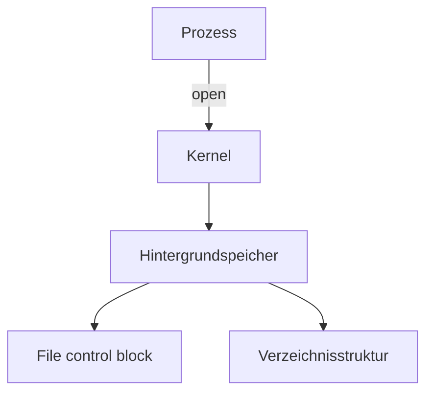

- Datei: Folge zusammengehöriger Daten
- Jede Datei braucht eine Struktur
  - Dateiname
  - Identifikator
  - Dateityp
  - Attribute
    - Zugriffsrechte
    - Benutzeridentitäten
    - Datum/Uhrzeit der Erstellung/Änderung
    - Größe
- Dateiverwaltung
  - Verwaltung der geöffneten Dateien
  - Abbildung der logischen Bytepositionen in der Datei auf physikalische Blocknummern im Hintergrundspeicher
  - Speicherverwaltung
  - Ermittlung der Geräteadressen
  - Scheduling von Zugriffen auf die Dateien
  - File Descriptor
    - Erzeugt eine neue Verwaltungsstruktur um die Datei zu verwalten
  - Jeder Prozess hat eine eigene Tabelle für FDs



```c
open(fn, r)
close(fd)
read(fd, buf, n)
```