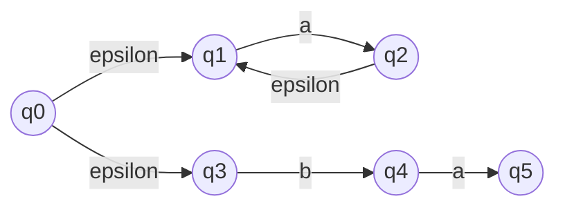

- 5-Tupel (siehe [[DEA|FOSAP.DEA]])

```mermaid
graph LR
q0((q0))
q1((q1))
q2((q2))
q3((q3))
q4((q4))
q5((q5))
q0-->|epsilon|q1
q2-->|epsilon|q1
q1-->|a|q2
q0-->|epsilon|q3
q3-->|b|q4
q4-->|a|q5
```
