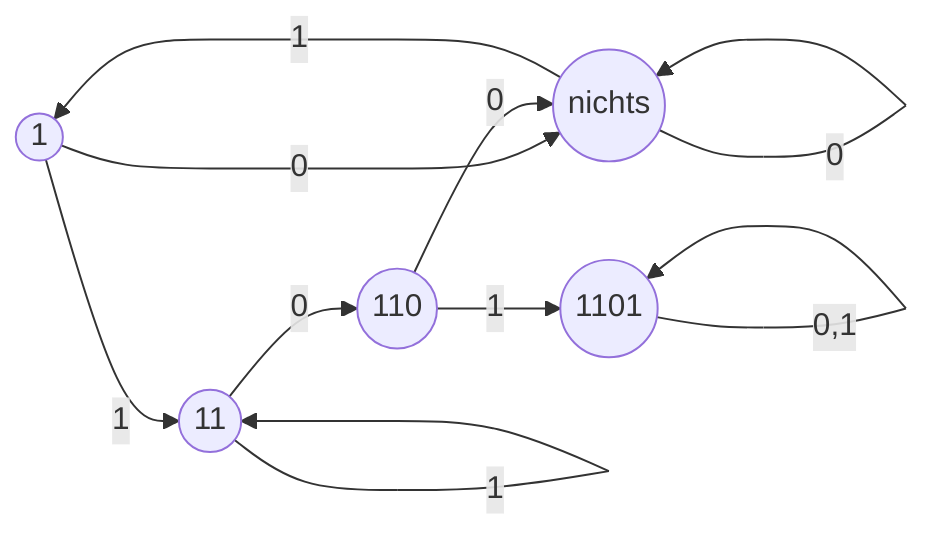
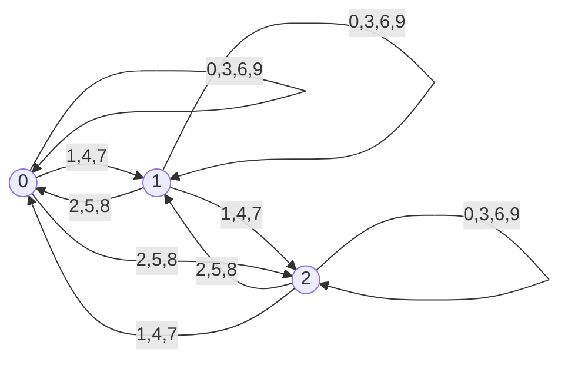
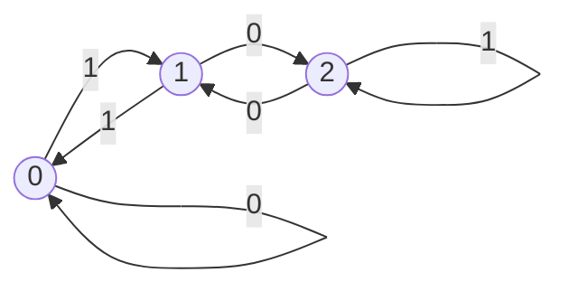

## Endliche Automaten
- Berechnungsmodell zur Beschreibung sequentiller Prozesse
- endliche Menge an Zuständen
- Hat einen Startzustand und 1 oder mehr Endzustände

### Mustererkennung

### Teilbarkeit durch 3

## Alphabet
- Nicht leere Menge
  - behinhaltet Symbole,Buchstaben oder Zeichen
- Ein Wort ist eine endliche Folge von Zeichen aus dem Alphabet

### Notation
- $\sum$,$\Gamma$ und Varianten wie $\sum_1$, $\Gamma'$
- $a,b,c,\dotsc$ und Varianten stehen für Zeichen

### Beispiele
1. Boolsche Alphabet $\{0,1\}$
2. Morsealphabet $\{.,-,\quad\}$

## Wörter
### Notation
- Ohne Klammern und Kommata
- $u,v,w,\dotsc$ und Varianten stehen für Wörter

## Sprache
- Menge von Wörtern

# DEA
- 5-Tupel $(Q,\sum,\delta,q_0,F)$
  - $Q$: Menge der Zustände
  - $\sum$: Eingabealphabet
  - $\delta: Q \times \sum \rightarrow Q$: Abbildung: die Transitionsfunktionen
  - $q_0 \in Q$: Der Anfangszustand
  - $F \subseteq Q$: Die Menge der Endzustände

## DEA: ist die binäre Zahlenfolge durch 3 teilbar

### Beweis
Für $w \in {0,1}*$ sei $b(w) \in \mathbb{N}$ der Wert von $w$ als Binärzahl.
#### Lemma
Seien $w\in \{0,1\}*$ und $a\in \{0,1\}$. Dann gilt
$$
  b(wa) = 2 \cdot b(w) + a
$$
##### Beweis
Sei $w=a_1,\dotsc, a_n$. Dann ist
$$
  b(wa) = \sum_{i=1}^n a_i2^{n+1-i}
$$

# Satz 1.29
Sei $L\subseteq\sum^*$ DFA-Erkennbar. Dann ist auch $\overline{L}$ DFA-Erkennbar.
- Wenn zwei Sprachen DFA-erkennbar sind, dann ist auch der Durchschnitt DFA-erkennbar.

