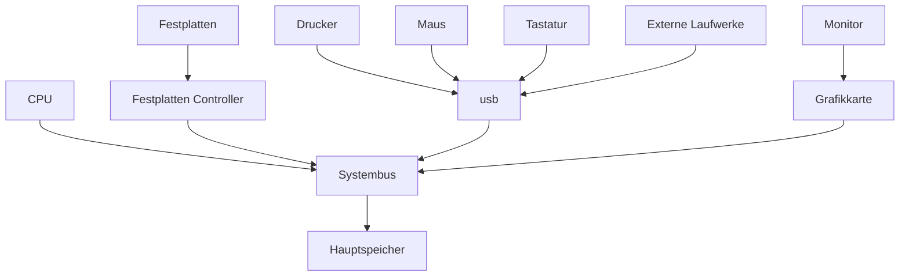

# Aufbau und Aufgaben
## Einteilung des Computers in vier Bereiche
1. Computer Hardware: Ansammlung von Betriebsmitteln, welche die Ausführung von Programmen ermöglichen
2. Betriebssystem: Verwaltung und Koordination der Hardware
3. System- und Anwendungsprogramme
4. Benutzer: Menschen oder andere Computer

## Computer-Hardware
- Systembus verbindet alle Geräte des Computers
   - Eine oder mehrere CPUs
   - Gemeinsamer Speicher für Aufgaben der CPU und anderer Geräte
   - Controller zum Anschluss von I/O-Geräten
- von-Neumann: Prominente Rechnerarchitektur

## CPU
- Verfügt über Register zur Ausführen von Operationen
  - Datenregister, Adressregister, Spezialregister
- Zusätzlich: Caches
  - Schneller Pufferspeicher
  - Schnellerer Zugriff auf Caches als als auf Hauptspeicher
  - Je kleiner, desto schneller
  - Caches sind transparent für das Betriebssystem

### Pipelining
-  Das Ausführen der einer Instruktion lässt sich in Unterinstruktionen aufteilen
   -  Fetch->Decode-Execute
- Dadurch lässt sich Instruktionsparallelismus implementieren
- Vorteil
  - Höherer Durchsatz
- Nachteil
  - Teilweise höhere Latenz

### Superskalare Ausführung
- Wenn mehr Ausführungseinheiten existieren, können mehrere Instruktionen parallel ausgeführt werden

## Zusammenspiel der Komponenten
- CPU führt Operationen aus
- CPU und I/O-Geräte werden nebenläufig ausgeführt
  - Jeder Controller ist für einen bestimmten Gerätetyp verantwortlich
  - Zur Ausführung einer Operation eines Gerätes wird die CPU gebraucht
    - Jeder Controller hat eigene Register und einen lokalen Buffer
    - Die CPU verschiebt Daten zwischen Hauptspeicher und Caches
    - Nach verschieben der Daten wird die Operation gestartet
  - Heute: DMA - Direct Memory Access
    - Separater Controller zum verschieben von Daten zwischen CPU und Geräten
    - Entlastung der CPU

# Betriebssystem:
- Ansammlung von Programmen zur effizienten und komfortablen Nutzung
  - Plattform zur Ausführung von Programmen
  - Effiziente Aufteilung der _Betriebsmittel_ (CPU, Festplatten, ...) auf mehrere Benutzer bzw. Benutzerprogramme
- Betriebsmittel:
  - Prozessoren, Prozesse, Threads
  - Speicher
    - Hauptspeicher, Caches, virtueller Speicher
  - Dateisystem
    - Verzeichnisse, Dateien
  - I/O-Geräte
    - Grafikkarte, Netzwerkkarte, Festplatte, Tastatur, Maus
  - Klassifikation
    - Exklusive oder geteilte Nutzung?
    - Entziehbar oder nicht entziehbar?
    - 