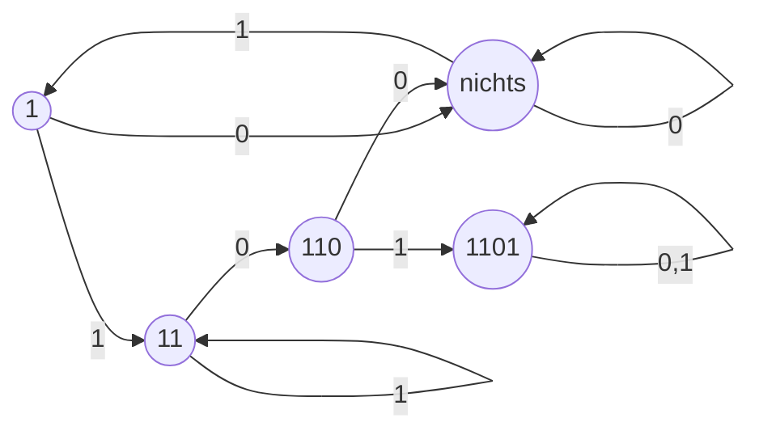
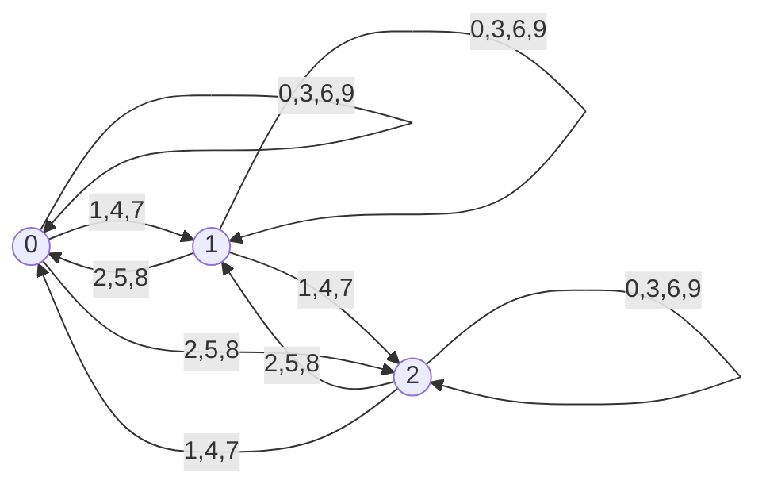

## Endliche Automaten
- Berechnungsmodell zur Beschreibung sequentiller Prozesse
- endliche Menge an Zuständen
- Hat einen Startzustand und 1 oder mehr Endzustände

### Mustererkennung

### Teilbarkeit durch 3

## Alphabet
- Nicht leere Menge
  - behinhaltet Symbole,Buchstaben oder Zeichen
- Ein Wort ist eine endliche Folge von Zeichen aus dem Alphabet

### Notation
- $\sum$,$\Gamma$ und Varianten wie $\sum_1$, $\Gamma'$
- $a,b,c,\dotsc$ und Varianten stehen für Zeichen

### Beispiele
1. Boolsche Alphabet $\{0,1\}$
2. Morsealphabet $\{.,-,\quad\}$

## Wörter
### Notation
- Ohne Klammern und Kommata
- $u,v,w,\dotsc$ und Varianten stehen für Wörter

## Sprache
- Menge von Wörtern

# DEA
- 5-Tupel $(Q,\sum,\delta,q_0,F)$
  - $Q$: Menge der Zustände
  - $\sum$: Eingabealphabet
  - $\delta: Q \times \sum \rightarrow Q$: Abbildung: die Transitionsfunktionen
  - $q_0 \in Q$: Der Anfangszustand
  - $F \subseteq Q$: Die Menge der Endzustände

