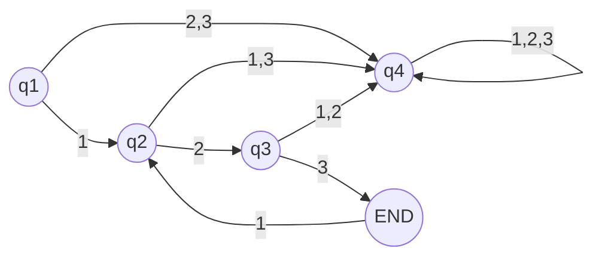

## 1)
### a)
$(KL)^*=(LK)^*\\$
$K\cup L=\emptyset\Rightarrow (KL)^*\neq(LK)^*\\$
- $K=\{k\},L=\{l\}$
- $lk\notin(KL)^*$
- $kl\notin(LK)^*$

### b)
- $K=\{k\}$
- Sei $e\in KK^*$
  
### c)
- $(K\cap L)^* \subseteq K^*\cap L^*$
- Sei $w\in K \cap L,u\in K|u\notin L$
  
### d)
- $K^*\cap L^* \subseteq (K\cap L)^*$

## 2)
### a)

### c)

## 4)
### a)
Alle Wörter, deren Länge mod 4 1,2 beträgt
### b)
